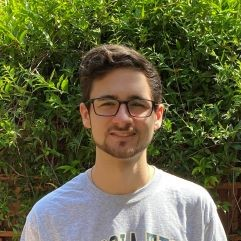

# About Me

I am a fourth-year Computer Science student at Georgia Tech, with a relentless passion for technology and innovation. My journey in the field has been a dynamic exploration, continually focused on curating and strengthening my versatile skillset. I've been fortunate to engage in invaluable experiences, including two AI/ML internships at Lockheed Martin, where I transformed raw projects into streamlined solutions, reducing manual efforts and optimizing user experiences.

My commitment extends to academia, where I serve as an undergraduate teaching assistant and engage in cutting-edge research at Georgia Tech. Beyond coursework and formal roles, my ambitions drive me to undertake personal projects, such as the development of a Spotify Companion Web App, where I merge technology and creativity to deliver unique user experiences.

What motivates me most is the desire to make a meaningful impact, foster constant growth, and nourish my passions. Whether it's coding, teaching, or researching, I am driven by the opportunity to contribute to the ever-evolving tech landscape and inspire others along the way.
